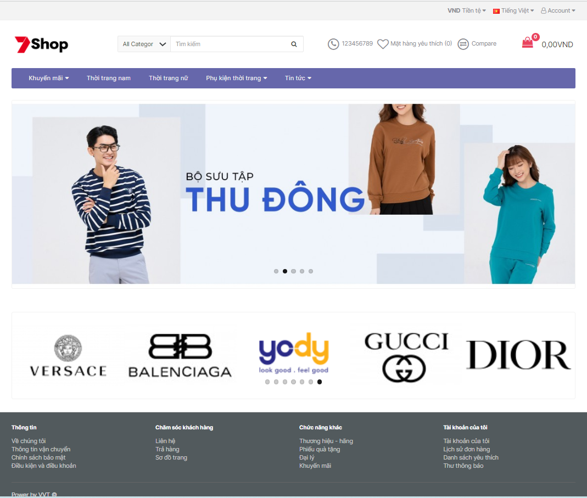
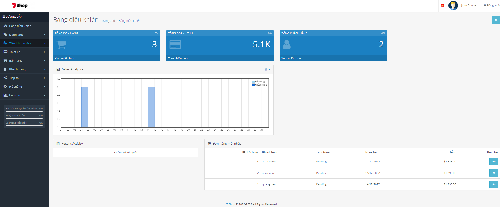
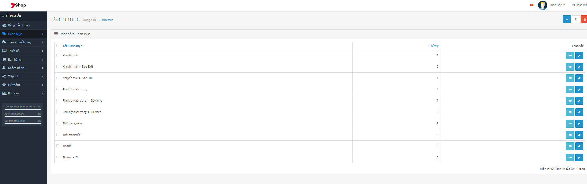
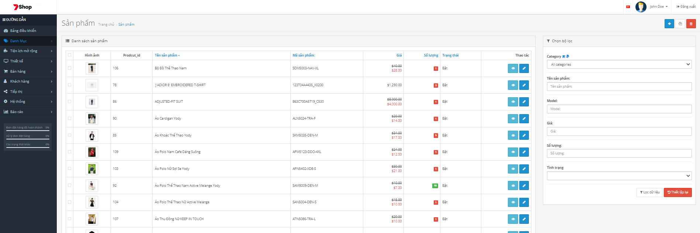
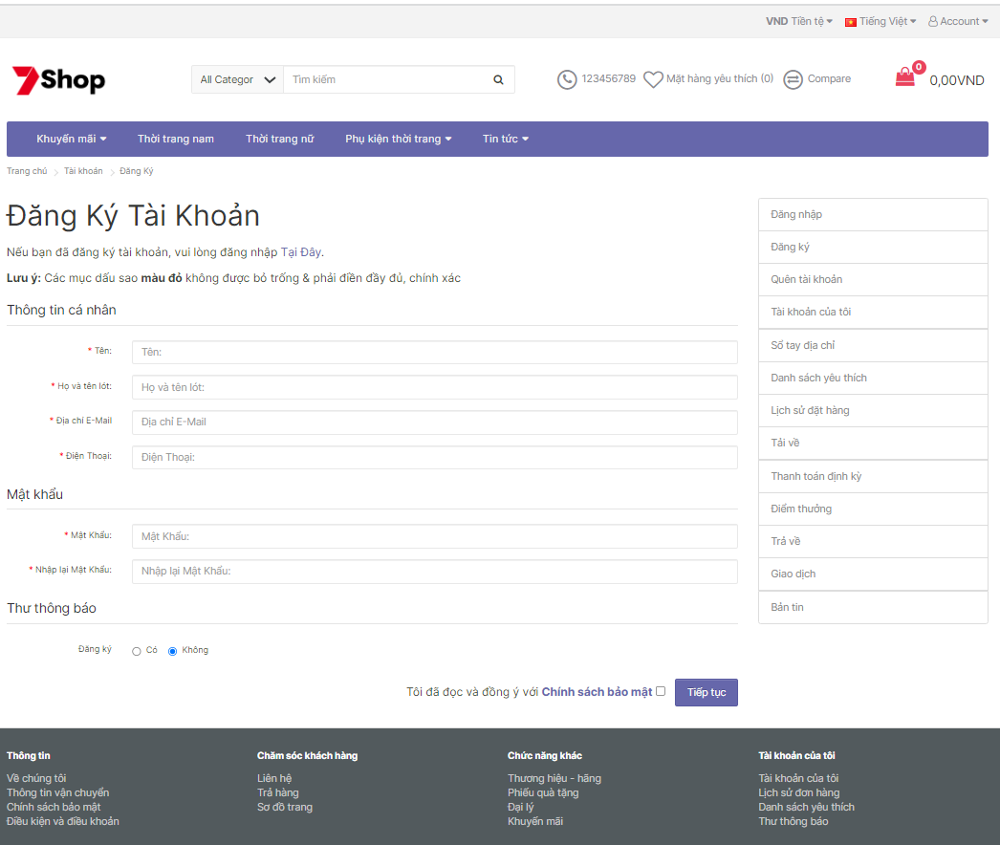
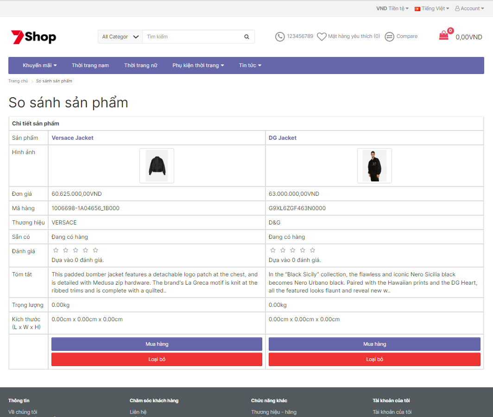

# Fashion Shop App🚀

 

## ⭐ Introduction

**Introducing Fashion Shop App**

## Home Page
This page introduces the store's featured products. Additionally, it provides information about societal trends.

## About Us Page
This page introduces the store.

## News Page
This page helps customers view information about brands, promotional discounts, and sales. The news provided helps customers understand more about the products they intend to purchase and also keeps them updated on current fashion trends.

## Products Page
This page allows customers to view or refer to the available products in the store for selection.

## Shopping Page
This page provides instructions on how to make payments and purchase products.

## Shipping Page
This page provides information about the store's shipping methods.

## Contact Page
This page allows customers to get in touch with the store.
    
    

## ❗ Note

-  Development branch contains the code for the localhost development version.
-  For the first run, execute the code inside the comment block: //Create a default Admin account in the Account Controller.
    
    

## 💻 Screens

 

## 🐦 Follow Me:

> [LinkedIn](https://www.linkedin.com/in/vankieuit/)

I hope you like the project. Thanks for reading :)
